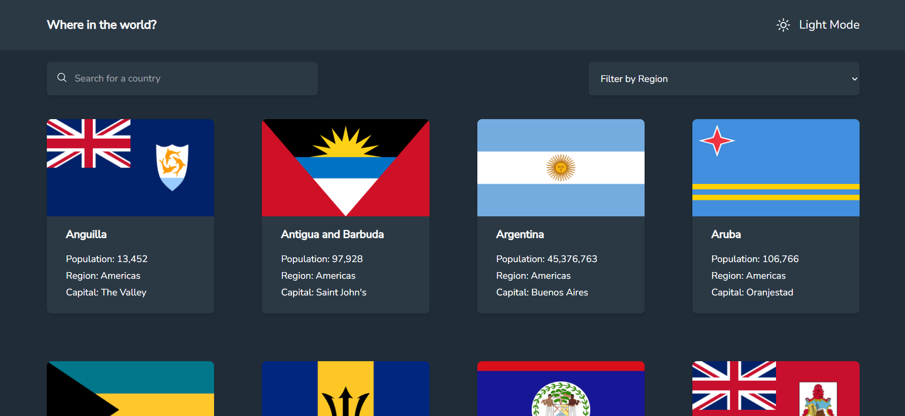

# Frontend Mentor - REST Countries API with color theme switcher solution
 
This is a solution to the [REST Countries API with color theme switcher challenge on Frontend Mentor](https://www.frontendmentor.io/challenges/rest-countries-api-with-color-theme-switcher-5cacc469fec04111f7b848ca).
 
## Table of contents
 
- [Overview](#overview)
  - [The challenge](#the-challenge)
  - [Screenshot](#screenshot)
  - [Links](#links)
- [My process](#my-process)
  - [Built with](#built-with)
  - [What I learned](#what-i-learned)
  - [Continued development](#continued-development)
- [Author](#author)
## Overview
 
### The challenge
 
Users should be able to:
 
- See all countries from the API on the homepage
- Search for a country using an `input` field
- Filter countries by region
- Click on a country to see more detailed information on a separate page
- Click through to the border countries on the detail page
- Toggle the color scheme between light and dark mode
### Screenshot
 

 
### Links
 
- Solution URL: [GitHub](https://github.com/MatinSalomon/rest-countries)
- Live Site URL: [rest-countries-ten.vercel.app](https://rest-countries-ten.vercel.app/#/)
## My process
 
### Built with
 
- Mobile-first workflow
- CSS custom properties
- Flexbox
- CSS Grid
- [React](https://reactjs.org/) - JS library
- [React Router](https://reactrouter.com/) - Client-side routing
- [TailwindCSS](https://tailwindcss.com/) - For styles
- [Vite](https://vitejs.dev/) - Build tool
### What I learned
 
The biggest learning in this project was understanding how to structure client-side navigation with **React Router**. Working with `Routes`, `useParams` and `useNavigate` helped me understand how to move between pages and pass data through the URL.
 
I also got comfortable with **useContext** as a way to centralize global state — in this case, the list of countries and the dark/light mode toggle — avoiding prop drilling across the component tree.
 
```jsx
// Consuming global state with a custom hook
const { countries, darkMode, searchTerm, selectedRegion} = useAppContext();
```
 
```jsx
// Reading URL params on the detail page
const { name } = useParams();
const country = countries.find(c => c.name === name);
```
 
### Continued development
 
In future projects I want to:SSSS
 
- Separate context responsibilities to avoid unnecessary re-renders (e.g. one context for data, another for theme)
- Add loading and error states when fetching data
- Improve accessibility (keyboard navigation, ARIA labels)
## Author
 
- Frontend Mentor - [@MatinSalomon](https://www.frontendmentor.io/profile/MatinSalomon)
- GitHub - [@MatinSalomon](https://github.com/MatinSalomon)
